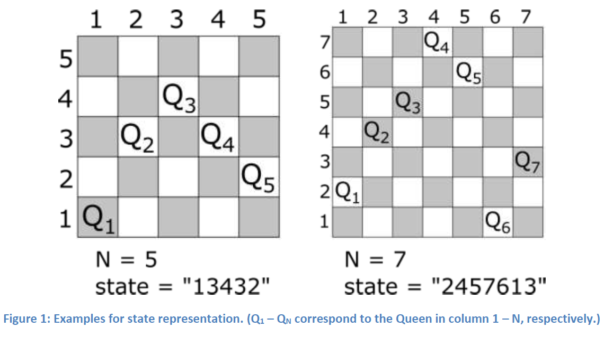

# simpleai_works
Solutions of N-Quenns problem with different algorithms, using simpleai library python

## Problem Description
---

N Queens Problem: “This is the problem of placing N chess queens on an NxN chessboard so that no
queens threaten each other; thus, a solution requires that no two queens share the same row, column,
or diagonal.” (Wikipedia) The most common form of this problem is 8-Queens.

Assuming that a single queen is placed on each column of the board. So, the state string will keep the row index for the queens on each column.
See the examples below:

